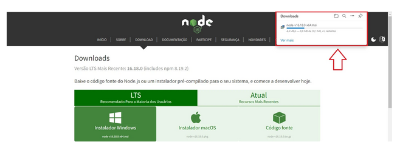
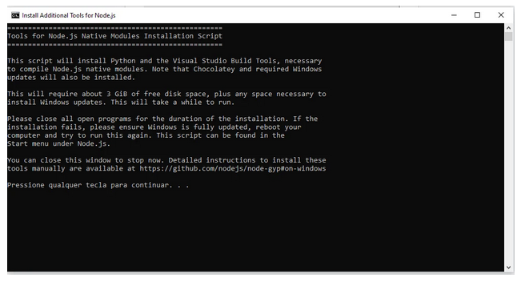
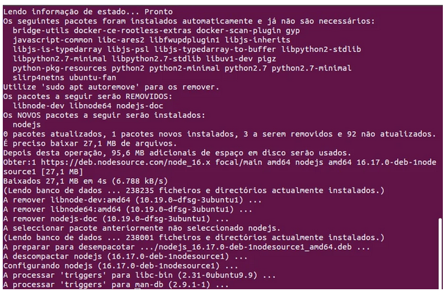
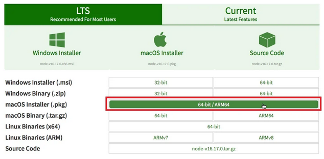
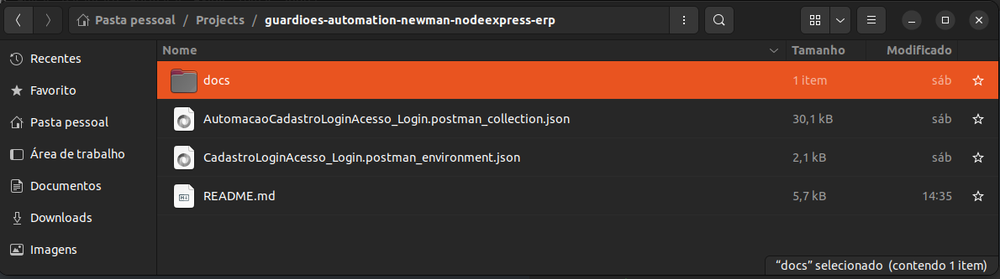
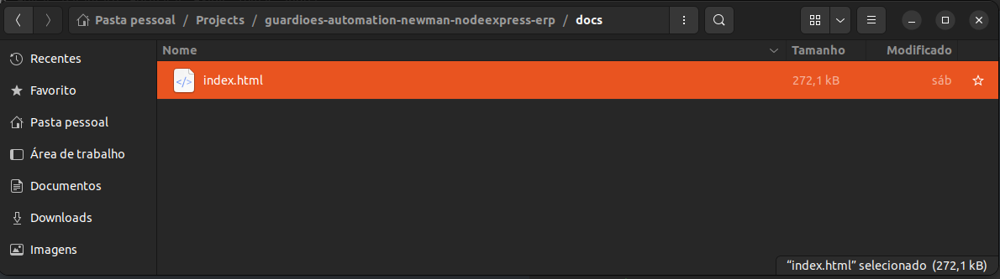
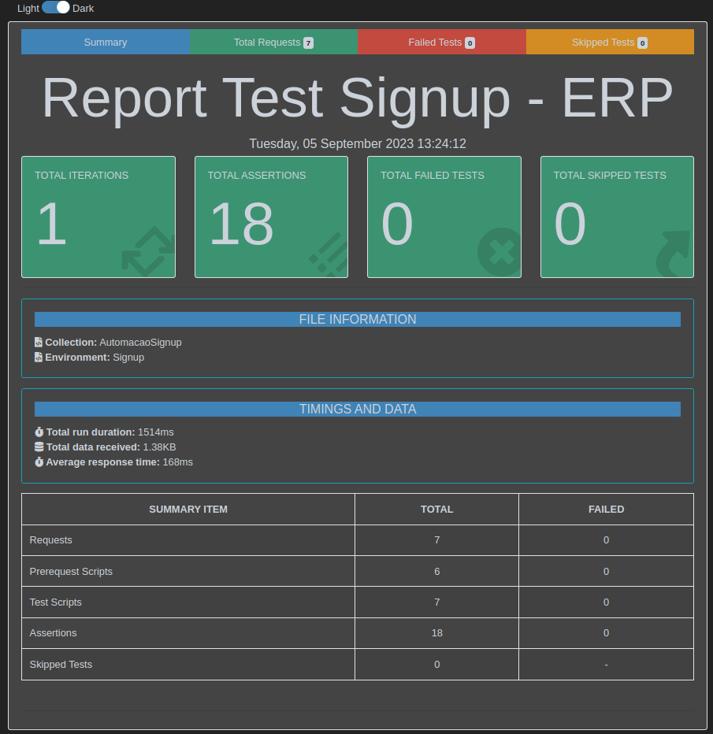

# Guardiões Automation Postman

[](https://github.com/KadarStudyDevOps/guardioes-automation-postman-erp-signup/actions/workflows/ci_ApiPostman_login.yml)

### DESCRIÇÃO:

Desenvolvido pela equipe Guardiões do Qa.Coders Academy, o objetivo deste projeto é desenvolver as habilidades práticas em automação dos testes de API com diferentes conjuntos de dados, validação dos resultados e a criação de um pipeline de CI/CD utilizando o Git Actions para executar e validar as Collections no Postman de forma automatizada.

> **Este repositório tem uma página de publicação do "report" do teste que utiliza o Github Pages para servir páginas estáticas. Esse relatório será renovado todas as vezes que o teste for realizado.**

### URL Base: 

​	https://postman-treinamento.qacoders-academy.com.br/

## HACKATHON

## Instalação do Ambiente

* É necessário ter o Node JS com a versão mais recente instalada em sua máquina. Recomendamos que utilize a versão LTS (*Long-term support*) porque é a mais estável. 

### Instalação no Windows:

Acesse a ** [página de download do Node.js](https://nodejs.org/en/download/).**

Ao clicar na opção Windows Installer da versão LTS, será iniciado o download automático do pacote instalador;

<p align="center">
  


Prossiga com a instalação clicando em "Next” para instalar as configurações padrão e clique em "Install”. Pode ser que algumas janelas do terminal se abram, que é justamente a responsável pela instalação das ferramentas para módulos nativos. Basta clicar em qualquer tecla para continuar e esperar até que seja finalizada:

<p align="center">
  


### Instalação no Linux:

Para instalar a versão LTS no Linux Ubuntu, digite os comandos abaixo no terminal bash ou outro de sua preferência:

```sh default
curl -fsSL https://deb.nodesource.com/setup_lts.x | sudo -E bash -
```

```sh default
sudo apt-get install -y nodejs
```

Após rodar o comando o terminal exibirá a tela de execução como mostrada na figura abaixo: 

<p align="center">
  


### **Instalação no MacOS:**

A instalação no macOS é similar com a instalação do Windows, pois também pode acessar **[página de download do Node.js](https://nodejs.org/en/download/)** e iniciar o processo por lá.

<p align="center">
  


Caso queira instalar pelo terminal, é necessário que tenha instalado o gerenciador de pacotes [**homebrew](https://brew.sh/index_pt-br) .**

Para instalar, basta digitar o comando `sudo brew install node js` no terminal e será instalada a versão mais recente.

Verifique se a instalação ocorreu corretamente e digite os comandos abaixo em seu terminal.

```sh default
node --version
```

Após a exibição da versão instalada, verifique também a versão do gerenciador de pacotes para o Node( NPM) com o comando `npm --version`.

Certifique-se que a versão mais recente do "NPM” esteja instalada. Saiba mais em: https://docs.npmjs.com/

### **Instalação do Newman:**

Nos respectivos terminais de comando de cada sistema operacional, digite o comando:

```sh default
npm install -g newman
```

**Verifique a versão instalada:**

```sh default
newman --version
```

**Instalação do newman-reporter-htmlextra**

```sh default
npm install -g newman-reporter-htmlextra
```

**Verifique a versão instalada:**

```sh default
newman-reporter-htmlextra --version
```

### **Git e GitHub**

No Git e GitHub, realize as seguintes etapas:

1. Instale e Configure a conta do Git. Para saber mais, [acesse o git](https://git-scm.com/download/win)
2. Abra o terminal e clone o repositório no GitHub com os comandos abaixo:

```sh default
git clone https://github.com/Qa-Coders/guardioes-automation-newman-nodeexpress-erp.git
```

  2.1 Após clonar entrar na pasta local do repositório com o comando:

```sh default
cd guardioes-automation-newman-nodeexpress-erp
```

  2.2 Para gerar o relatório do Newman execute o comando abaixo:

```sh default
newman run ./AutomacaoSignup.postman_collection.json -e ./Signup.postman_environment.json --reporters cli, -r htmlextra --reporter-htmlextra-browserTitle "Report Test Signup - ERP" --reporter-htmlextra-title "Report Test Signup - ERP" --reporter-htmlextra-export ./docs/index.html
```

  2.3 Caso no relatório aparece erro de Certificado SSL execute o comando abaixo (acrescentando “-k” para ignorar o certificado):

```sh default
newman run ./AutomacaoSignup.postman_collection.json -e ./Signup.postman_environment.json -k --reporters cli, -r htmlextra --reporter-htmlextra-browserTitle "Report Test Signup - ERP" --reporter-htmlextra-title "Report Test Signup - ERP" --reporter-htmlextra-export ./docs/index.html
```
  2.4 Para visualizar o relatório gerado navegue até a pasta "docs" criada dentro do repositório e de dois (2) cliques no arquivo index.html para ser aberto no navegador padrão.

<p align="center">
  
</p>

<p align="center">
  
</p>

<p align="center">
  
</p>

3. Configuração do pipeline de CI/CD no Git Actions, que será responsável por automatizar a execução dos testes no Postman sempre que houver alterações no repositório.

​	Para verificar como é script acessem o script no caminho abaixo:

​	[Link para o arquivo .yml](https://github.com/Qa-Coders/guardioes-automation-newman-nodeexpress-erp/blob/master/.github/workflows/ci_ApiTreinPostman.yml)

### Importar Collection e Environment no Postman:

1. Crie um Workspace no Postman caso não tenha. Para mais informações, acesse o [site](https://www.softwaretestinghelp.com/postman-collections-import-export-generate-code/).
2. Importe os dois JSON. Para mais informações, acesse o [site](https://www.softwaretestinghelp.com/postman-collections-import-export-generate-code/).

### Projeto Desenvolvido por:

| [<br/><sub>Adriano de Oliveira Santos</sub>](https://github.com/Adreewoliver)<br/>[](https://www.linkedin.com/in/adriano-de-oliveira-santos-784979253/) | [<br/><sub>Amauri Almeida de Souza Junior</sub>](https://github.com/amaurialmeida)<br/>[](https://www.linkedin.com/in/amauri-almeida26/) | [<br/><sub>Daiane Barbosa Soares</sub>](https://github.com/Day-Qa)<br/>[](https://www.linkedin.com/in/daiane-barbosa-soares-a0841aa9/) | [<br/><sub>Francisbele Sampaio</sub>](https://github.com/f-sam-paio)<br/>[](https://www.linkedin.com/in/francisbele-sampaio-473477108) |
| :----------------------------------------------------------: | :----------------------------------------------------------: | :----------------------------------------------------------: | :----------------------------------------------------------: |
| [<br/><sub>Gledson da Silva Sousa</sub>](https://github.com/Gledson013)<br/>[](https://www.linkedin.com/mwlite/in/gledson-sousa/) | [<br/><sub>Isadora dos Santos Arcosy</sub>](https://github.com/ArcosyIsa)<br/>[](https://www.linkedin.com/in/isadoraarcosy) | [<br/><sub>Liza Almeida e Lima</sub>](https://github.com/lizalima16)<br/>[](www.linkedin.com/in/lizaalmeidaelima) | [<br/><sub>Lorena da Silva Ferreira de Brito</sub>](https://github.com/LorenaBrito28)<br/>[](https://www.linkedin.com/in/lorenafbrito/) |
| [<br/><sub>Luciana Santos</sub>](https://github.com/LueSantos)<br/>[](https://www.linkedin.com/in/luesantos) | [<br/><sub>Mariana Nogueira de Morais</sub>](https://github.com/Marinmorais)<br/>[](https://www.linkedin.com/in/mariana-nogueira-829a4b265) | [<br/><sub>Raquel Helena Swire Guimarães</sub>](https://github.com/rhswire)<br/>[](https://www.linkedin.com/in/rhswire) | [<br/><sub>Sidney Moreira</sub>](https://github.com/SidneyMoreira)<br/>[](https://www.linkedin.com/in/sidmoreira/) |
